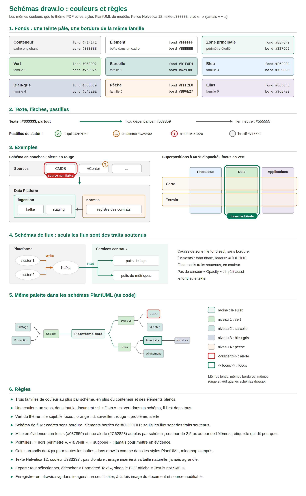

= Mode d'emploi
:toc:
:toclevels: 2
:sectnums:
:lang: fr

Ce document dit comment faire : installer le poste, démarrer une étude, travailler au quotidien, produire et livrer un document, tenir l'étude à jour du modèle.
Pourquoi le modèle est construit ainsi : xref:architecture.adoc[Architecture du modèle].
Règles de rédaction : `normes/`.

[[installer]]
== Installer le poste

Une fois par poste.

* Ruby avec les gems ci-dessous, Java pour PlantUML, `grep` et `awk` : `check.sh`, le hook et le rendu PDF tournent sur le poste.
+
[source,sh]
----
gem install asciidoctor asciidoctor-pdf asciidoctor-diagram asciidoctor-diagram-plantuml rouge text-hyphen
----
* La police DejaVu Sans, celle des schémas : sans elle, leur texte sort étiré dans le PDF (sur macOS, `brew install --cask font-dejavu`).
* À défaut, Docker ou podman : `check.sh`, le hook et `build.sh` passent alors par l'image `asciidoctor/docker-asciidoctor`, qui contient tout.
Chaque contrôle, donc chaque commit d'un `.adoc`, prend alors quelques secondes de plus : le temps de lancer le conteneur.
Derrière un miroir d'entreprise, déclarer l'image dans le profil du shell (voir <<pdf>>).
* L'extension AsciiDoc de VS Code, pour l'aperçu.
* Un agent : pi, ou le chat de VS Code en mode agent, chacun avec le modèle de son choix (LLM interne compris) ; et `rg` (ripgrep) pour ses recherches.
* L'accès aux bases de connaissances Qdrant : l'extension pi-rag sous pi, le serveur MCP `rag` (`rag-query mcp`, en stdio) sous VS Code, déclaré dans la configuration MCP de l'utilisateur, jamais dans un `.vscode/mcp.json` versionné avec l'étude.
Sous VS Code, cocher ses outils dans le sélecteur d'outils du mode agent.

`tools/status.sh` dit ce qui manque.

[[modele-llm]]
=== Choisir le modèle de l'agent

Le modèle compte plus que l'agent qui le porte.
Trois critères :

* *Une fenêtre de contexte de 128K tokens recommandés.*
Le dépôt est découpé pour y tenir : `AGENTS.md`, les normes utiles, un skill et un fragment de 40 Ko au plus.
En dessous, l'agent perd en cours de tâche les normes ou les registres qu'il vient de lire.
* *Un appel d'outils fiable.*
En mode agent, tout passe par des outils : lire un fichier, chercher avec `rg`, interroger le RAG, écrire.
Un modèle qui les appelle mal échoue, quelle que soit sa taille.
* *Une taille adaptée à la tâche :*
+
[cols="3,2"]
|===
| Tâche | Modèle

| Intégrer un entrant, rédiger ou illustrer un chapitre, revue `traçabilité`, `sources` ou `rendu`, étayer une affirmation
| Classe 30B, 128K de contexte.

| Revue `cohérence` d'un maître entier, synthèse, note de réflexion, exploration d'options
| Un modèle plus grand, ou meilleur en raisonnement ; 256K de contexte aident à garder un maître entier en vue.
|===

Ces repères reflètent l'état des modèles à l'automne 2026, et viennent de l'usage, pas d'une mesure : les modèles progressent vite, une classe plus petite pourra suffire demain ; les confirmer sur ses propres tâches avant de s'y fier.
Sous VS Code, l'agent Relecteur peut fixer son propre modèle (champ `model`), pour réserver le plus grand aux revues qui en ont besoin.

[[demarrer]]
== Démarrer une étude

. Créer le dépôt de l'étude vide sur la forge (sans README ni licence).
. Le créer par un clone du modèle, qui garde son historique et permet d'en tirer les évolutions (<<modele>>) ; pas par « Use this template », qui coupe cet historique :
+
[source,sh]
----
git clone https://github.com/DBuret/architect-foundry.git mon-etude && cd mon-etude
----
. Si l'étude a une base projet : la déclarer et y ingérer ses entrants (<<rag>>).
. Lancer `tools/init.sh`, qui demande les valeurs dans un terminal ou les reçoit en options :
+
[source,sh]
----
tools/init.sh --projet "Gestion des secrets" --kb gestion-secrets \
  --sites https://developer.hashicorp.com/vault/docs --maitres note,dat \
  --depot <url du dépôt de l'étude>
----
+
[cols="1,3"]
|===
| Option | Effet

| `--projet`
| `:project:` de chaque maître gardé.

| `--kb`
| `:kb-projet:` : le nom de la base projet, tel que déclaré dans `~/.pi/agent/rag.json`. Facultatif : sans base projet, l'agent ne vérifie rien dans les entrants et ne cherche que dans `multi-projets`.

| `--sites`
| `:sites-projet:` : URL des sites de référence du projet (documentation d'un éditeur, par exemple), séparées par des virgules. L'agent y cherche ce que les bases ne couvrent pas. Facultatif.

| `--maitres`
| Les maîtres à garder parmi `memo`, `dat` et `note` ; les autres sont supprimés. Par défaut, tous. Choisir : xref:architecture.adoc#types[types de documents].

| `--depot`
| L'`origin` du clone, qui pointe sur le modèle, devient `modele` ; `origin` pointe sur le dépôt de l'étude. Rien n'est poussé.
|===
+
Il active aussi le hook pre-commit et le pilote de fusion qui protège les fichiers de l'étude, puis lance `check.sh`.
Il se relance sans risque : les nouvelles valeurs remplacent les anciennes.
. Faire ce qu'`init.sh` rappelle en fin de sortie :
** le titre de chaque maître ;
** les deux logos neutres, remplacés en gardant leur nom : `tools/pdf-theme/header-logo.png` (en-tête des pages, de préférence huit fois plus large que haut) et `images/logo.png` (page de titre) ;
** les entrées d'exemple `H1`, `PO-01` et `ADR-01`, remplacées par celles de l'étude.
. `tools/check.sh` sans KO, puis `git commit` et `git push -u origin main`.

[[rejoindre]]
== Rejoindre une étude existante

Les réglages du hook et du pilote de fusion vivent dans `.git/config`, qui n'est pas versionné : chaque personne qui clone l'étude les refait.

[source,sh]
----
git clone <url du dépôt de l'étude> && cd <dossier>
git config core.hooksPath tools/hooks
git remote add modele https://github.com/DBuret/architect-foundry.git   # pour tirer le modèle
git config merge.etude.driver true      # idem
----

[[quotidien]]
== Travailler au quotidien

L'architecte écrit l'étude ; l'agent l'assiste.
Chaque tâche ci-dessous se fait à la main, avec l'agent, ou en mêlant les deux : écrire un passage et le faire relire, demander un premier jet et le réécrire, rédiger le raisonnement et faire sourcer les affirmations.
Les mêmes normes et les mêmes contrôles valent dans tous les cas : `check.sh` et le hook ne savent pas qui a écrit.

[[ecrire]]
=== Écrire soi-même

Dans VS Code, avec l'extension AsciiDoc : ouvrir le fragment, et son aperçu à côté (commande « AsciiDoc: Open Preview to the Side »).
Les règles de rédaction sont dans `normes/asciidoc.adoc`, à lire une fois ; le format des registres, dans `normes/registres.adoc`.

* Une hypothèse, un point ouvert ou une décision se crée dans son registre, en copiant une entrée existante, puis se cite par son ancre : `<<H2>>`, jamais « voir H2 ».
* Une affirmation tirée d'un document se cite avec sa source ; une indication orale devient une hypothèse qui dit qui l'a donnée, quand et dans quel cadre.
* Un schéma se dessine en PlantUML, avec le style commun (`normes/schemas.adoc`).

.Exemple : un paragraphe et l'hypothèse qu'il cite
[source,asciidoc]
----
// deploiement.adoc
La rotation des secrets est quotidienne : la fenêtre d'exposition d'un
secret volé ne dépasse pas vingt-quatre heures, si <<H2>> se confirme.

// hypotheses.adoc
[[H2]]
== H2 : Rotation quotidienne supportée

.Statut
Non validée.

.Énoncé
Les applications rechargent un secret renouvelé sans redémarrage.

.Origine
Indication orale du responsable applicatif, atelier du 2 octobre 2026.
----

[source,sh]
----
tools/check.sh                       # renvois, registres, schémas
git commit -am "Rotation des secrets"   # le hook relance check.sh
----

=== Appeler un skill

L'agent charge seul le skill qui correspond à la demande, d'après sa description.
Ce chargement peut manquer : pour l'imposer, l'appeler explicitement.

[cols="1,2,2"]
|===
| | pi | VS Code (chat en mode agent)

| Appeler un skill
| `/skill:revue-etude cohérence memo.adoc`
| `/revue-etude cohérence memo.adoc`

| Intégrer un entrant, rédiger
| session neuve par tâche
| mode Agent par défaut, conversation neuve par tâche

| Relire
| skill `revue-etude`, session neuve par axe
| agent *Relecteur*, conversation neuve par axe

| Étayer une idée
| skill `justifier-idee`
| agent *Justificateur d'idée*, ou sous-agent du Relecteur
|===

.Exemple : imposer le skill de revue
[source,text]
----
/skill:revue-etude cohérence memo.adoc        (pi)
/revue-etude cohérence memo.adoc              (VS Code)
----

Si les skills n'apparaissent pas dans le menu `/` de VS Code, vérifier qu'ils sont activés dans les réglages du chat.

Une tâche par session : un entrant, un chapitre, ou un axe de revue sur un périmètre.
L'état est dans git et dans `work/`, pas dans la conversation.

=== Intégrer un entrant

Après une réunion, un courriel, une indication orale, ce qu'il apporte se range dans les registres : hypothèses, points ouverts, décisions à proposer.
À la main, voir <<ecrire>>.
Avec l'agent : coller les notes dans une session neuve et demander de les intégrer (skill `integrer-entrant`), en précisant qui, quand et dans quel cadre si les notes ne le disent pas.

.Exemple de demande
[source,text]
----
Intègre ces notes : atelier exploitation du 2 octobre 2026, avec le
responsable de production.
- Trois nœuds suffisent pour la charge prévue jusqu'en 2028.
- La rotation automatique des secrets n'est pas encore validée par la sécurité.
- L'équipe préfère éviter un nouveau fournisseur.
----

L'agent crée les nouvelles hypothèses, points ouverts et ADR proposées dans les registres.
Ce qui touche une entrée existante (une hypothèse validée, un point ouvert qui a sa réponse) n'est pas modifié : c'est une proposition dans `work/entrant-<date>.adoc`, à trancher.
Changer un statut reste une décision de l'architecte, qu'il fait lui-même ou demande explicitement.

=== Rédiger un chapitre

. Écrire le chapitre (<<ecrire>>), ou en demander un premier jet à l'agent dans une session neuve, puis le reprendre.
L'agent suit la structure du type du maître et rédige le texte en entier, sans schéma.
. Illustrer le chapitre, soi-même ou avec le skill `illustrer-etude` : mindmaps et WBS, seulement là où le texte franchit le seuil des normes.
. `tools/check.sh` : aucun KO, chaque AVERT corrigé ou compris.
. Relire le diff, puis commiter ; le hook relance `check.sh`.

.Exemple : premier jet et illustration par l'agent, une session par étape
[source,text]
----
Rédige le chapitre « Déploiement cible » du mémo, dans deploiement.adoc,
à partir des hypothèses H1 et H2 et du point ouvert PO-01.

Illustre deploiement.adoc.
----

[source,sh]
----
tools/check.sh
git diff
git commit -am "Chapitre déploiement cible"
----

La synthèse s'écrit en dernier, une fois le corps stable.
Quand une étude produit un DAT et un mémo, le mémo se rédige à partir du DAT.

[[dessiner]]
=== Dessiner un schéma à la main

Un schéma que PlantUML ne sait pas faire (couches, matrices, flux entre plateformes) se dessine dans draw.io, ou avec l'extension « Draw.io Integration » de VS Code.
Il reprend la palette des schémas PlantUML pour que le document reste homogène : les règles sont dans `normes/schemas.adoc`, « Couleurs des schémas » ; la planche ci-dessous les montre.

Une fois par poste, dans draw.io, menu « Extras », puis « Configuration », coller ce qui suit et redémarrer : la palette apparaît dans le panneau « Style », et les nouvelles formes prennent la bonne police et la bonne couleur de texte.

[source,json]
----
{
  "customColorSchemes": [[
    {"fill": "#F1F1F1", "stroke": "#BBBBBB"},
    {"fill": "#FFFFFF", "stroke": "#BBBBBB"},
    {"fill": "#EEF6F2", "stroke": "#227C63"},
    {"fill": "#D3EDD2", "stroke": "#769D75"},
    {"fill": "#D1E6E4", "stroke": "#62938E"},
    {"fill": "#E6F2FD", "stroke": "#7F9BB3"},
    {"fill": "#D6DDE9", "stroke": "#848E9E"},
    {"fill": "#FFF2E8", "stroke": "#B96E27"},
    {"fill": "#ECE6F3", "stroke": "#9C8FB2"},
    {"fill": "none", "stroke": "#087859"},
    {"fill": "none", "stroke": "#C62828"}
  ]],
  "defaultVertexStyle": {"fontFamily": "Helvetica", "fontSize": "12", "fontColor": "#333333", "html": "0",
                         "rounded": "1", "absoluteArcSize": "1", "arcSize": "8"},
  "defaultEdgeStyle": {"strokeColor": "#087859", "fontColor": "#333333"}
}
----

Pour chaque schéma :

. L'enregistrer en `.drawio.svg` dans `images/` : l'image du document et sa source en un seul fichier.
. Avant d'enregistrer, tout sélectionner et décocher « Formatted Text » : sinon le PDF affiche « Text is not SVG ».
. L'insérer à sa taille naturelle : `image::mon-schema.drawio.svg[Texte alternatif]`.
. Produire le PDF (`tools/build.sh`) et vérifier le schéma dans la page.

=== Relire

Une revue porte sur un axe et un périmètre : `revue-etude traçabilité git diff`, `revue-etude cohérence memo.adoc`.

[cols="1,3"]
|===
| Axe | Pour

| `traçabilité`
| Chaque critère renvoie à la bonne hypothèse, au bon point ouvert, à une source.

| `cohérence`
| Mêmes noms et chiffres partout, synthèse fidèle au corps, accord avec les entrants écrits.

| `sources`
| Chaque affirmation sur un produit, un entrant ou une norme est vérifiée dans la bonne base.

| `rendu`
| Défauts visibles seulement dans le PDF.

| `décision`
| Chaque ADR dit ses options écartées, ses preuves, le risque accepté, sa réversibilité et ce qui la ferait réviser.

| `robustesse`
| Faiblesses de l'architecture par point de vue (exploitation, résilience, sécurité, coûts…), rendues en questions à trancher.

| `concision`
| Ce qui peut disparaître sans perte de décision, de preuve ou de compréhension.
|===

.Exemples de demandes
[source,text]
----
revue-etude traçabilité git diff
revue-etude sources deploiement.adoc
revue-etude décision adr.adoc
revue-etude robustesse memo.adoc, points de vue exploitation et sécurité
revue-etude concision memo.adoc
----

Le rapport est écrit dans `work/revue-etude-<date>.adoc`.
La revue constate et propose ; elle ne corrige rien sans accord.

=== Étayer ou explorer

* *Étayer une idée* : « justifie cette affirmation » (skill `justifier-idee`).
L'agent cherche dans les bases ce qui la soutient et ce qui la contredit, et rend un verdict par affirmation dans `work/justification-<date>.md`.
* *Explorer* : « explore les options pour… », « quels critères pour… ».
L'agent cherche des pistes dans la base `multi-projets` et les liste dans `work/exploration-<date>.adoc`.
Une piste retenue n'entre dans l'étude qu'une fois sourcée, ou comme hypothèse.

.Exemples de demandes
[source,text]
----
Justifie cette affirmation de deploiement.adoc, section « Déploiement cible » :
« la rotation automatique des secrets réduit le risque de fuite ».

Explore les options de stockage des secrets pour des applications
conteneurisées, et les critères pour choisir.
----

=== Faire le point, préparer un comité

[source,sh]
----
tools/status.sh            # outils, hook, registres, KO et AVERT, PDF périmés, git
tools/status.sh --rapide   # sans check.sh
tools/status.sh --comite   # ce qui attend une réponse
----

`--comite` liste les points ouverts avec leur porteur et leur échéance, marquée « ÉCHÉANCE PASSÉE » quand sa date est dépassée, les hypothèses non validées ou invalidées avec leur origine, et les ADR proposées.
Une échéance écrite `2026-11-15`, `15/11/2026`, `15 novembre 2026` ou `novembre 2026` est reconnue ; une autre forme s'affiche sans contrôle.

[[pdf]]
== Produire le PDF

[source,sh]
----
tools/build.sh             # tous les maîtres
tools/build.sh memo.adoc   # un seul
----

Le PDF est écrit dans `work/`, sous le nom de son maître (`work/memo.pdf`).
`build.sh` relance d'abord `check.sh` et ne produit rien en cas de KO.

*Lire la sortie.*
Les WARNING et ERROR d'asciidoctor-pdf qui suivent ne bloquent pas le PDF, mais signalent ce que `check.sh` ne voit pas : une cellule de tableau trop étroite (`cannot fit contents of table cell`), un SVG mal dessiné, un caractère absent des polices, un logo introuvable.
Chacun se corrige ou s'explique ; l'axe `rendu` de `revue-etude` relit le PDF lui-même.

*Textes provisoires.*
`build.sh` signale en AVERT, fichier et ligne à l'appui, chaque « À rédiger. », « À désigner. » ou « À fixer. » resté dans le maître ou dans ce qu'il inclut.
Normaux pendant la rédaction, ils n'ont pas leur place dans un PDF livré.

*Outils du poste ou conteneur.*
`build.sh` utilise les outils du poste quand ils y sont tous, l'image Docker sinon ; `BUILD=docker` force l'image, pour un rendu aux versions exactes qu'elle fixe (`1.108.0`) ; `check.sh` suit la même règle.
Ce qui est propre au poste ou à l'entreprise se déclare une fois dans le profil du shell (`~/.zshrc`, `~/.bashrc`) et vaut pour toutes les études du poste :

[cols="1,3"]
|===
| Variable | Rôle

| `BUILD`
| `docker` : contrôle et rendu dans l'image même si les outils sont sur le poste ; vide par défaut.

| `ASCIIDOCTOR_IMAGE`
| Image du build ; par défaut l'image publique du Docker Hub. Un miroir d'entreprise s'y déclare : `export ASCIIDOCTOR_IMAGE=registre.interne/asciidoctor/docker-asciidoctor:1.108.0`.

| `PDF_HEADER_LOGO`
| Logo d'en-tête, chemin relatif à la racine du dépôt (seule montée dans le conteneur) ; vide, `tools/pdf-theme/header-logo.png` ; `aucun`, pas de logo.

| `PDF_HEADER_LOGO_WIDTH`
| Largeur du logo d'en-tête, en pixels ; 200 par défaut.

| `DOCKER`
| Moteur de conteneurs compatible (`podman`...) ; `docker` par défaut.
|===

[[livrer]]
== Livrer un document

Un document livré est un PDF produit depuis un commit tagué : on sait quelle version chaque lecteur a entre les mains, et on peut la reproduire.
La procédure vaut pour les trois types ; ce qui est propre à chacun est dans <<livrer-type>>.

=== Préparer

. *Figer le contenu.*
Les chapitres sont rédigés, illustrés et commités ; la synthèse est relue en dernier, après tout changement du corps.
Ne pas tirer le modèle dans les jours qui précèdent : une nouvelle norme peut demander des corrections.
. *Assumer ce qui reste incertain.*
`tools/status.sh --comite` liste ce que la synthèse affichera dans ses tableaux d'incertitudes : chaque hypothèse non validée et chaque point ouvert y figurent volontairement, avec un porteur et une échéance.
Une échéance passée se met à jour avant de livrer.
Dans un mémo, l'ADR qui porte la recommandation reste « Proposé » : c'est la direction qui décide.
. *Relire le maître entier*, une session neuve par axe ; chaque constat retenu se corrige et se commite avant l'axe suivant :
.. `traçabilité` : chaque critère renvoie à la bonne hypothèse, au bon point ouvert, à une source ;
.. `sources`, si toutes les affirmations n'ont pas été vérifiées pendant la rédaction ;
.. `cohérence` en dernier, puisqu'elle vérifie que la synthèse est fidèle au corps.
. *Vérifier ce que le type exige* et que `check.sh` ne mesure pas (<<livrer-type>>).
. *Fixer la version.*
`:revnumber:` dans le header du maître, à `0.1` dans le modèle.
La page de titre l'affiche : « Version 1.0 ».
+
[cols="1,3"]
|===
| Version | Usage

| `0.1`, `0.2`...
| Version de travail diffusée pour avis.

| `1.0`
| Première version soumise à décision ou à validation.

| `1.1`, puis `2.0`
| Correction après retours ; nouvelle version qui change une recommandation ou l'architecture.
|===
. *Partir d'un arbre propre.*
`tools/status.sh` : aucun KO, aucun fichier non commité.

=== Produire et contrôler le PDF

. `tools/build.sh memo.adoc` (ou `dat.adoc`, `note.adoc`).
Chaque WARNING ou ERROR d'asciidoctor-pdf se corrige ou s'explique, et aucun texte provisoire ne reste (<<pdf>>).
. Revue sur l'axe `rendu`, dans une session neuve : `revue-etude rendu memo.adoc`.
L'agent lit le PDF produit et rattache chaque défaut à sa ligne source.
. Feuilleter le PDF soi-même, ce qu'aucun contrôle ne remplace : page de titre (titre, version, logo), sommaire, synthèse sur une page, schémas lisibles, tableaux de registres complets.
. Toute correction se commite, puis le PDF se reproduit : le PDF diffusé est celui du dernier build sur un arbre propre.

=== Taguer et diffuser

[source,sh]
----
git tag -a memo-v1.0 -m "Mémo v1.0, comité d'architecture du 12 novembre 2026"
git push origin main memo-v1.0
cp work/memo.pdf <dossier de diffusion>/<projet>-memo-v1.0.pdf
----

* Le tag s'appelle `<maître>-v<revnumber>` et son message dit à qui ou à quelle instance la version est destinée.
* `work/` n'est pas versionné : le PDF se reproduit depuis le tag (`git checkout memo-v1.0 && tools/build.sh memo.adoc`), à la date près, qui est celle du build, en pied de page.
* Le fichier diffusé porte le projet, le type et la version : `memo.pdf` ne dit plus rien une fois joint à un courriel.

=== Après la livraison

* Les retours du comité, des relecteurs ou des équipes sont un entrant : skill `integrer-entrant`.
Ce qui touche une entrée existante est proposé dans `work/`, pas appliqué.
* Ce que l'instance a tranché, l'architecte le reporte, lui-même ou par une demande explicite à l'agent, en disant qui et quand : « Accepté par le comité d'architecture du 12 novembre 2026. » pour une ADR, « Clos… » pour un point ouvert, « Validée… » pour une hypothèse.
* La version suivante reprend la procédure depuis le début.

[[livrer-type]]
=== Ce que chaque type exige

[cols="1,4"]
|===
| Type | À vérifier avant de livrer

| Mémo
| La synthèse tient sur une page et se lit seule : question, options, recommandation, décision attendue (qui, quelle instance, quelle date), risques majeurs.
Le corps tient en dix à quinze pages, sans bloc de code ; le détail technique est en annexe.
Chaque option a les mêmes rubriques, coût et réversibilité compris.
Les critères ont une source et une méthode de mesure ; leurs seuils sont laissés à la direction.
Aucun budget ni planning n'est présenté comme un résultat de l'étude.

| DAT
| Chaque choix structurant a son ADR ; chaque flux et chaque donnée cités sont décrits.
Le DAT se livre à chaque jalon du projet (`1.0` pour le pilote, `2.0` pour la généralisation, par exemple) : entre deux, il vit dans git.

| Note
| La rubrique « Ce qui a changé depuis la version précédente » de la synthèse est à jour ; les idées non démontrées sont des hypothèses, pas des affirmations du corps.
|===

[[rag]]
== Déclarer une base de connaissances

La configuration RAG est globale au poste : `~/.pi/agent/rag.json` déclare la base `multi-projets` et les bases de projet, toutes sur le même Qdrant local et le même modèle d'embedding.
Ne pas ajouter de `.pi/rag.json` dans le dépôt d'une étude : pi-rag n'utilise que le premier fichier trouvé, et celui du dépôt remplacerait toute la configuration globale.

Une nouvelle base projet se déclare en copiant l'entrée d'un projet existant ; seuls changent le nom, la description et la collection.
La description dit que la base contient les entrants de l'étude : elle aide l'agent à choisir la bonne base.

[source,json]
----
"gestion-secrets": {
  "description": "Entrants et documentation du projet Gestion des secrets : cadrage, présentation de lancement, livrables amont",
  "vectorStore": "qdrant-local",
  "embeddingProvider": "litellm-qwen3",
  "collection": "projet-gestion-secrets",
  "vectorName": "text",
  "distance": "cosine",
  "payload": {
    "content": "content", "title": "document_title", "source": "source_path",
    "page": "page", "section": "section",
    "metadata": ["doc_type", "status", "year", "doc_version", "domaine"]
  },
  "filterableFields": ["doc_type", "status", "year", "domaine", "source_name"],
  "search": { "topK": 8, "maxTopK": 20, "maxCharsPerChunk": 4000, "maxTotalChars": 40000 }
}
----

Les entrants s'ingèrent avec `ingest run <dossier> --kb <nom>` ; `rag-query` interroge les bases hors agent.
Un sidecar `metadata.json` par dossier de corpus donne à chaque document `doc_title`, `doc_type`, `status`, `year` et, au besoin, `doc_version`, `langue`, `domaine`.

* *Renseigner `doc_title`.*
L'étude cite ses sources par leur titre ; sans `doc_title`, le titre se replie sur celui du PDF, puis sur le nom de fichier.
* *Les métadonnées servent à juger.*
Les outils RAG ne renvoient que les champs de `payload.metadata` : ce sont eux qui permettent à l'agent de citer une version, d'écarter un document obsolète, de préférer un document actif à un brouillon.
Pour les documents de projet, ils restent facultatifs.
* *Ne pas ingérer l'étude en cours*, ou donner à ses exports un `doc_type` propre (`etude`) : sinon l'agent risque de confirmer l'étude par sa version précédente.
* *Pas de seuil de score.*
Chaque recherche renvoie `topK` passages, même sans rapport : c'est le réglage de départ, en attendant de calibrer un seuil avec `rag-query eval`, puisque l'agent juge chaque passage à la lecture.

[[sites]]
== Déclarer les sites de référence

Les sites de référence complètent les bases de connaissances : la documentation d'un éditeur, le portail d'une norme, le site d'un partenaire.
Ils se déclarent dans l'en-tête de chaque maître, par l'attribut `:sites-projet:`, URL séparées par des virgules ; vide, l'étude n'en a pas.

[source,asciidoc]
----
:sites-projet: https://developer.hashicorp.com/vault/docs, https://www.ssi.gouv.fr
----

* *À la création*, `init.sh --sites` le renseigne dans tous les maîtres gardés.
Ensuite, la ligne se modifie à la main, avec la même valeur dans chaque maître : si elles diffèrent, l'agent le signale et demande.
* *Ce qu'en fait l'agent.*
Ce que les bases ne couvrent pas, il le cherche d'abord sur ces sites, avant toute autre recherche web.
Un site fait foi pour ce qu'il publie sur son propre domaine, comme la documentation technique d'un éditeur ; sur ce qui a été demandé ou décidé pour le projet, la base projet prime, et un écart entre les deux est signalé, pas tranché.
* *Il faut un outil web à l'agent.*
Sous VS Code, l'outil `web` lit une page dont l'URL est connue, sans moteur de recherche ; les agents Relecteur et Justificateur d'idée l'ont.
Sous pi, une extension de recherche web est nécessaire.
Sans outil web, ou site inaccessible, les vérifications qui en dépendent sont marquées « non vérifié ».
* *Citation.*
Une page se cite par son titre, en lien (`link:URL[Titre]`), avec la date de consultation : une page change, un PDF ingéré non.
* *Confidentialité.*
Seul du contenu public est cherché sur le web : l'agent n'y envoie jamais de nom de projet, d'architecture cible, de chiffre interne ni d'extrait des bases.

[[modele]]
== Tirer les évolutions du modèle

Une évolution du modèle (une norme, un correctif de `check.sh`, un skill) se tire dans l'étude au moment choisi :

[source,sh]
----
git fetch modele
git merge modele/main    # ou une version précise : git merge v1.0.0
tools/check.sh           # une nouvelle norme peut faire apparaître des AVERT
git push
----

Le modèle est publié en versions, `vMAJEURE.MINEURE.CORRECTIF`, et le numéro dit ce qu'une mise à jour peut demander à l'étude :

[cols="1,3"]
|===
| Version | Contenu

| Majeure (`v2.0.0`)
| Une évolution qui peut faire échouer `check.sh` sur une étude existante : nouvelle règle bloquante, format de registre changé. Lire les notes de version avant de fusionner.

| Mineure (`v1.1.0`)
| Un ajout : skill, axe de revue, contrôle en AVERT, option d'outil.

| Correctif (`v1.0.1`)
| Une correction, sans rien de nouveau à apprendre.
|===

Les notes de chaque version sont sur la page des releases du dépôt.

Toujours une fusion, jamais un rebase, qui réécrirait l'historique déjà poussé de l'étude ; en une ligne : `git pull --no-rebase modele main`.
Éviter de tirer le modèle juste avant de livrer un PDF : ses nouvelles normes peuvent demander des corrections.
Si le modèle n'est pas joignable depuis le poste, en tenir un miroir sur la forge interne et l'utiliser comme remote `modele`.

La fusion se fait sans conflit tant que chacun reste chez lui (xref:architecture.adoc#etude-modele[étude et modèle]).
Ce qui reste à la main :

* Une évolution d'un maître d'exemple qui intéresse l'étude : le pilote de fusion l'écarte ; elle se reporte à la main (`git log -p ORIG_HEAD..modele/main -- memo.adoc` la montre juste après la fusion).
* Un maître supprimé par l'étude et modifié par le modèle (« deleted by us ») : `git rm` du fichier, puis `git commit`.
* Un fichier du modèle retouché dans l'étude : conflit ordinaire.
Prendre la version du modèle (`git checkout --theirs -- <fichier>`) et proposer la retouche au modèle : une amélioration des normes ou des outils se fait dans le modèle, jamais dans une étude.

=== Rattacher une étude créée par copie

Une étude copiée sans l'historique du modèle se rattache une fois.
Sans ancêtre commun, la première fusion met en conflit chaque fichier présent des deux côtés.
On garde la version de l'étude pour ses `.adoc` de la racine, `images/` et le logo d'en-tête, celle du modèle pour le reste ; l'ordre des trois `checkout` compte :

[source,sh]
----
git remote add modele https://github.com/DBuret/architect-foundry.git && git fetch modele
git merge --allow-unrelated-histories --no-commit modele/main
git checkout --ours -- ':(glob)*.adoc' images
git checkout --theirs -- tools normes doc .agents .github AGENTS.md README.adoc LICENSE .vscode .gitattributes .gitignore
git checkout --ours -- tools/pdf-theme/header-logo.png
git status               # git rm -f les maîtres d'exemple que l'étude n'utilise pas
git add -A && git commit -m "Rattachement au modèle"
git config merge.etude.driver true
----

[[depannage]]
== Dépannage

*Commit refusé depuis VS Code, « KO prérequis absent : asciidoctor », alors que `tools/check.sh` passe dans le terminal.*
Le hook tourne dans l'environnement de VS Code, pas dans celui du terminal ; le message vient d'un poste où ni asciidoctor ni le moteur de conteneurs ne sont trouvés.
Lancé depuis le Dock ou le menu Démarrer, VS Code ne lit pas toujours le profil du shell (`~/.zshrc`, `~/.bashrc`), et ignore donc le chemin d'un asciidoctor installé par rbenv, Homebrew ou `gem install --user`.
Fermer VS Code et le rouvrir depuis un terminal, à la racine de l'étude : `code .`.
Il hérite alors du PATH du terminal.

[[modifier-modele]]
== Modifier le modèle

Dans le dépôt du modèle seulement.

[cols="1,2"]
|===
| Après une modification de | Lancer

| `tools/check.sh`
| `tools/tests/check-test.sh` : des mini-études jetables, chacune avec son code retour et sa sortie attendus.

| thème, `build.sh`, extensions, `normes/plantuml/`
| `tools/tests/rendu.sh`, puis relire page à page `work/rendu.pdf`, qui contient un exemple de chaque élément autorisé par les normes.
|===
